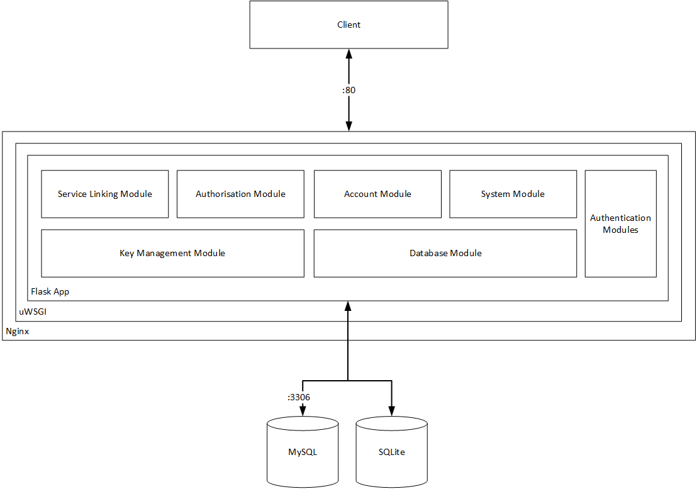

# MyData Account - Documentation

## High level prerequisites
- [Flask](http://flask.pocoo.org/)
- [Flask-RESTful](http://flask-restful.readthedocs.io)
- [JWCrypto](https://jwcrypto.readthedocs.io/en/stable/)
- [MySQL 5.6](https://www.mysql.com/)
- [Python 2.7](https://www.python.org/download/releases/2.7/)

## Detailed Documentation
- [Deployment](deployment.md)
- [API documentation](api/)
- [Database documentation](database/)
- [Developer one-liners](developer_oneliners.md)

## Application Modules

### Account module
Account module (mod_account) provides implementation to fulfill requirements of external API that provides APIs for front-end applications.

### Service Linking module
Service module (mod_service) provides implementation to fulfill requirements of MyData Service Linking Specification.

### Authorization module
Authorization module (mod_mod_authorization) provides implementation to fulfill requirements of MyData Authorization Specification.

### Key Management module
Key Management module (mod_blackbox) provides key management services for MyData Account. This module is meant only for demonstration purposes. Module does not provide a secure key store.

### Database module
Database module (mod_database) provides database integration for MyData Account.

### System module
System module (mod_system) provides system health checks.

### Authentication module
Authentication modules (mod_auth and mod_api_auth) provide authentication logic for APIs.

### Tests

#### Test cases for Internal API
SdkTestCase class (test_sdk.py) provides test cases for Internal API

#### Test cases for External API
UiTestCase class (test_ui.py) provides test cases for External API

## Architecture
High level description of MyData Account Architecture

